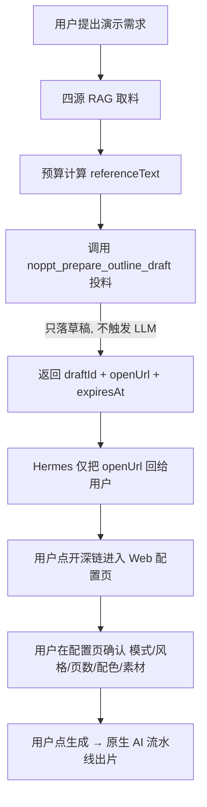

# Hermes × NoPPT 调用 SOP（人在回路工作流）

> 适用范围：智能体（Hermes）需要帮用户**发起一份演示**，但**先让用户把关主题/素材/风格**，由用户在 NoPPT Web 配置页确认后再生成。
> 核心原则：**只投料、不生成**；投递后**只回 `openUrl`**，停在 Web「AI 生成演示」配置页等用户确认。
>
> 这与 `README` 的「Agent 联调约定」小节一致，本文件是可直接粘贴进 Hermes 的**可执行版**。

---

## 0. 三条铁律（务必遵守）

1. **只用 `noppt_prepare_outline_draft` 投递，禁止用 `noppt_generate` 直接出片。**
2. **`referenceText` 预算 = `800 × slideCount`，`clamp(3000, 20000)`；最重要内容放最前**（超限直接从头部截断）。
3. **草稿 `mode` 固定 `auto`；投递后只把 `openUrl` 回给用户，停在配置界面等确认。**

---

## 1. 前置条件（一次性）

| 项 | 要求 |
| --- | --- |
| NoPPT 服务端 | 已启动，`PORT=3001`，MCP 端点 `http://localhost:3001/api/mcp` |
| NoPPT Web | 已启动，`NOPPT_WEB_URL=http://localhost:5173` |
| Hermes MCP 配置 | `config.yaml` 已加 `noppt` 服务（`url` + `Authorization: Bearer ${MCP_NOPPT_API_KEY}`） |
| API Key | 已签发名为 `hermes-local` 的 Key（scope: `tenant=hermes`、`user=local`，见 README「方式 B」管理接口），**不要使用仓库外的字面值** |
| 连通验证 | 执行 `hermes mcp test noppt`，预期 `Tools discovered: 8` |

> 作用域：`tenantId=hermes`、`userKey=local` 时，深链为 `…/?ai=1&draft=…&t=hermes&u=local&token=…`，与 Web 端作用域一致。

---

## 2. 全链路流程图



---

## 3. 步骤一：四源 RAG 取料

按以下优先级检索权威素材，冲突时按仲裁规则取舍：

| 级别 | 来源 | 检索方式 | 备注 |
| --- | --- | --- | --- |
| **L0** | 单源 LLM Wiki | 经 Hermes `llm-wiki` 技能，引用用 `[[concepts/xxx]]` | 项目根目录 `wiki/`（本地资料，git 忽略） |
| **L1** | 本地 corpus | 读取项目根目录 `corpus/` 下 4 篇：`01-product-overview` / `02-architecture-mcp` / `03-ai-modes` / `04-glossary` | 本地语料，git 忽略 |
| **L2** | 联网检索 | Hermes `web.backend: ddgs` | 实时补充，需交叉验证 |
| **L3** | aws-knowledge | Hermes MCP `aws-knowledge`（`aws___*` 工具） | AWS 相关权威文档 |

**冲突仲裁**：`L3 ≈ L1 > L2`（AWS/L1 本地语料优先于联网检索；L3 与 L1 同级，取更贴合者）。

> 若本地 `wiki/`、`corpus/` 不存在（如 clone 环境），直接用 L2/L3 取料，或要求用户补充素材后再投。

---

## 4. 步骤二：预算计算（拼 `referenceText`）

1. 确定目标页数 `slideCount`（默认按需求或 8 页）。
2. 计算预算：`budget = clamp(800 × slideCount, 3000, 20000)`。
   - 例：`slideCount=8` → `800×8=6400` → 预算 6400 字。
   - `slideCount=2` → `1600` → 下限截断到 **3000** 字。
   - `slideCount=40` → `32000` → 上限截断到 **20000** 字。
3. 把四源素材按**重要性排序**，最重要的放最前；超出预算时**从尾部丢弃**（后端也会从头截断，但前端先排好序可保核心不丢）。
4. `referenceSource` 填来源标识（如「企业知识库 / RAG」），仅用于前端展示。

---

## 5. 步骤三：调用 `noppt_prepare_outline_draft`

参数（`arguments`）映射：

| 字段 | 说明 | 必填 |
| --- | --- | --- |
| `topic` | 自拟演示主题（≤500 字） | ✅ |
| `referenceText` | 第 4 步拼好的权威素材（≤预算） | 可选 |
| `referenceSource` | 素材来源标识，仅展示 | 可选 |
| `slideCount` | 1–40 | 可选 |
| `style` | `business` / `tech` / `academic` / `creative` | 可选 |
| `colorTheme` | `blue` / `purple` / `green` / `orange` / `teal` / `gray` | 可选 |
| `audience` | 受众描述 | 可选 |
| `fontFamily` | `sans` / `serif` / `mono` | 可选 |
| `mode` | **固定 `auto`**（除非有意用 `guided`） | 可选，默认 `auto` |

**示例调用（Hermes 内部组装的 JSON-RPC `tools/call` 参数）：**

```json
{
  "name": "noppt_prepare_outline_draft",
  "arguments": {
    "topic": "NoPPT 产品概述与架构",
    "referenceText": "<按 800×slideCount 预算裁剪、重要放最前的 RAG 整理稿>",
    "referenceSource": "企业知识库 / RAG",
    "slideCount": 8,
    "style": "tech",
    "colorTheme": "blue",
    "audience": "技术决策者",
    "fontFamily": "sans",
    "mode": "auto"
  }
}
```

**返回体（`result.content[0].text` 是一段 JSON 字符串，需再 parse）：**

```json
{
  "draftId": "dft_xxx",
  "openUrl": "http://localhost:5173/?ai=1&draft=dft_xxx&t=hermes&u=local&token=...",
  "expiresAt": "2026-09-12T...Z",
  "mode": "auto",
  "topic": "NoPPT 产品概述与架构",
  "meta": { "referenceTextChars": 6400, "truncated": false, "source": "企业知识库 / RAG" },
  "note": "仅备料，未生成演示。请把 openUrl 发给用户，由其在 NoPPT Web 配置页确认后生成。"
}
```

注意 `meta.truncated=true` 表示素材被截断——确保核心内容已排在前面。

---

## 6. 步骤四：回 `openUrl`，停在配置页

- **只把 `openUrl` 交给用户**，并提示：点开后在 Web「AI 生成演示」配置页确认生成模式/风格/页数/配色，再点生成。
- **不要**返回 `jobId`、`viewUrl` 或成片内容——本流程没有生成动作。
- 深链有 `expiresAt` 时效，过期返回 `draft_expired`，需重新生成一条。

---

## 7. 提示词模板（已拆分为两份）

> 原「可直接粘贴的提示词」已按用途拆成两份独立文件，按需取用、互不重复：

- **`HERMES_NOPPT_USER_PROMPT.md`** —— **用户任务指令版**：整段复制进 Hermes 聊天框作为**用户消息**即可触发一次任务。带 `{{...}}` 占位、自包含，不依赖 system 版也能跑。
- **`HERMES_NOPPT_SYSTEM.md`** —— **系统提示版**：整段固化进 Hermes **`AGENTS.md`** 或 Skill 的 **`SKILL.md`**，使每个会话默认遵守「人在回路」约定（稳定、不针对某次任务）。

两者分工：用户版回答「**这次**要做什么」、含具体占位；系统版回答「**永远**怎么做」、是项目级铁律。

---

## 8. 反例（不要这样做）

| 反例 | 后果 |
| --- | --- |
| 直接调 `noppt_generate` | 立即异步出片，绕过用户确认，违反「人在回路」 |
| 把全量素材原样塞进 `referenceText` 不裁剪 | 超限从头截断，可能丢核心内容；且浪费 token |
| 返回 `jobId` / `viewUrl` 给用户 | 用户拿不到可确认的配置入口 |
| `mode` 误填 `guided` 且未说明 | 与团队约定（固定 `auto`）不一致 |
| 用仓库外写死的 Key 字面值 | 密钥泄露风险（应自行签发名为 `hermes-local` 的 Key，scope: tenant=hermes/user=local） |

---

## 9. 常见问题

- **`hermes mcp test noppt` 不到 8 个工具？** 检查 NoPPT server 是否运行、`config.yaml` 的 `url`/`headers` 是否正确、MCP 配置是否在会话启动后加载（改完需重开会话）。
- **深链打开报 `draft_expired`？** 草稿过期，重新走一遍 SOP 生成新链接。
- **`forbidden_scope`？** 深链的 `t=hermes&u=local` 与该 Key 的 scope 不一致，确认两端同为 `tenant=hermes` / `user=local`。
- **`referenceText` 被截断（`meta.truncated=true`）？** 前端已按预算裁剪，确保核心内容排在素材最前面。
- **clone 环境没有 `wiki/` `corpus/`？** 这两目录 git 忽略，clone 者需自备或用 L2/L3 取料。
