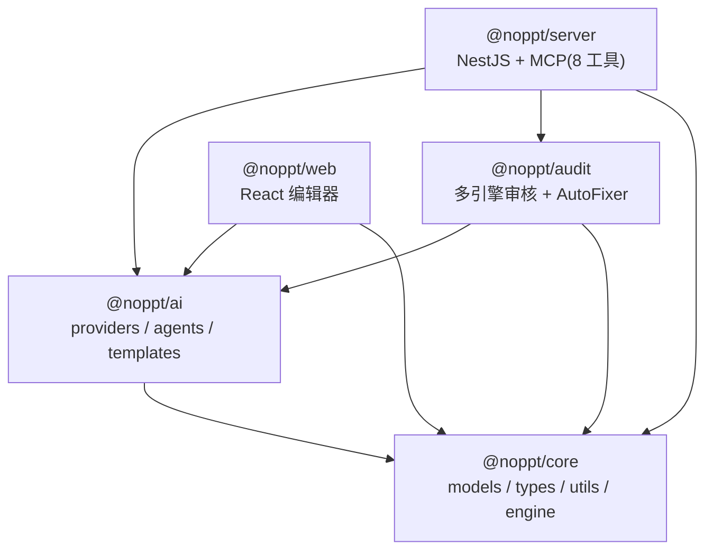
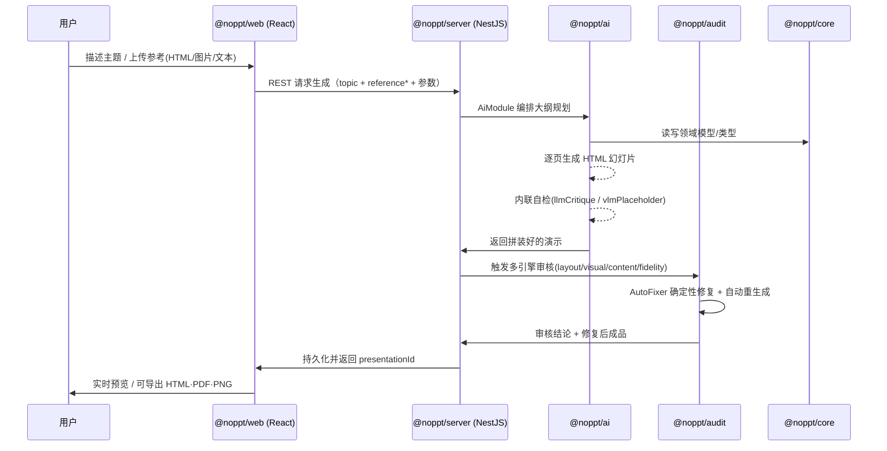
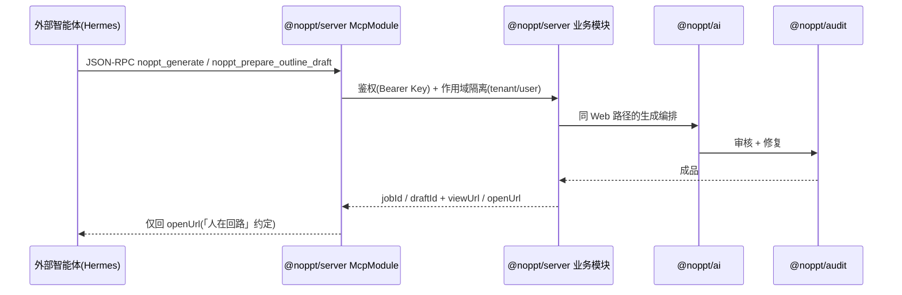

# NoPPT 架构总览

> 本文面向**人类开发者**，描述 NoPPT monorepo 的分层结构、包依赖关系与一次「演示生成」的数据流。
> 逐包的公共 API 与模块细节见 [`packages/`](./packages/) 下的分文档。
> 本仓库另有 git 忽略的 `wiki/`（L0 单源 LLM Wiki，供 Hermes 检索注入演示 RAG），与本文档面向不同受众，互不冲突。

---

## 1. Monorepo 布局

NoPPT 是 pnpm workspace，根 `package.json` + `pnpm-workspace.yaml` 管理 5 个包：

| 包 | 名称 | 层 | 一句话定位 |
| --- | --- | --- | --- |
| `packages/core` | `@noppt/core` | 基座 | 领域模型、类型、工具与引擎（无内部依赖） |
| `packages/ai` | `@noppt/ai` | 智能体 | 模型供应商、AI 智能体（大纲/HTML 生成）、模板与样式工具 |
| `packages/audit` | `@noppt/audit` | 质量 | 多引擎质量审核（布局/视觉/内容/保真）+ 自动修复 |
| `packages/web` | `@noppt/web` | 前端 | React + Vite 编辑器与演示预览（私有包） |
| `packages/server` | `@noppt/server` | 后端 | NestJS 后端（REST + MCP），编排 ai/audit/core（私有包） |

私有包（`web`、`server`）不发布，仅内部使用；`core/ai/audit` 通过 `exports` 暴露公共 API 供其他包 `workspace:*` 引用。

---

## 2. 包依赖关系

依赖方向为「被依赖 ← 依赖方」。箭头 `A --> B` 表示 **A 依赖 B**（即 B 是 A 的下层）。

**分层结论**：

- `@noppt/core` 是地基，不依赖任何内部包；所有其它包都间或依赖它。
- `@noppt/ai` 站在 `core` 之上，是「生成能力」的核心。
- `@noppt/audit` 依赖 `ai` + `core`：审核需要复用 ai 的 LLM/VLM 能力来评判成品。
- `@noppt/web` 依赖 `ai` + `core`：编辑器前端直接调用 ai 的智能体做生成，并消费 core 的领域类型。
- `@noppt/server` 是顶层编排者，同时依赖 `ai`、`audit`、`core`，把生成与审核串成完整流水线，并通过 REST/MCP 暴露给 web 与外部智能体。

依赖均通过 `package.json` 的 `dependencies` 中的 `workspace:*` 声明，且被 TypeScript `exports` 约束——内部包**不应**跨层 `import` 私有（非导出）路径。

---

## 3. 一次「演示生成」的数据流

NoPPT 有两条进入生成流水线的入口：**Web 编辑器（人类）** 与 **MCP 智能体（Hermes 等）**。两者最终都汇聚到 `server` 的 `AiModule` → `@noppt/ai` → `@noppt/audit` → `@noppt/core`。

### 3.1 Web 编辑器路径（人类触发）

### 3.2 MCP 智能体路径（外部 Agent 触发）

> 「人在回路」约束：智能体**优先用 `noppt_prepare_outline_draft` 只备料、返回 `openUrl`**，由用户在 Web 配置页确认后再生成；禁止直接 `noppt_generate` 出片。详见根 `README_CN.md` 的「Agent 联调约定」与 `HERMES_NOPPT_SOP.md`。

---

## 4. 跨切面关注点

- **i18n**：界面语言字典在 `packages/web/src/i18n/`，服务端消息目录在 `packages/server/src/i18n/`；二者独立，通过 `Accept-Language` 对齐。
- **配置**：运行时配置落在 `packages/server/data/config.json`（及其 `config.example.json` 脱敏模板），含 AI 模型路由、`auditSettings`、`inlineSelfCheckSettings`。
- **MCP**：`server` 暴露 8 个 `noppt_*` 工具（生成/轮询/三类编辑/导出/列模板/草稿备料），端点 `POST /api/mcp`，Streamable HTTP、无状态、JSON-RPC 2.0，Bearer Key 鉴权 + `tenant/user` 作用域隔离。
- **数据私有化**：所有产物存于 `packages/server/data/`，无云端锁定；该目录 git 忽略。

---

## 5. 阅读顺序建议

1. 先看本文档建立全局心智模型。
2. 按依赖自下而上读：`core.md` → `ai.md` → `audit.md` → `server.md` / `web.md`。
3. 改了某包**对外导出**的公共 API 时，同步更新对应 `packages/*.md`（见 [`contributing/DOCS_WORKFLOW.md`](../repo-wiki/contributing/DOCS_WORKFLOW.md)）。
